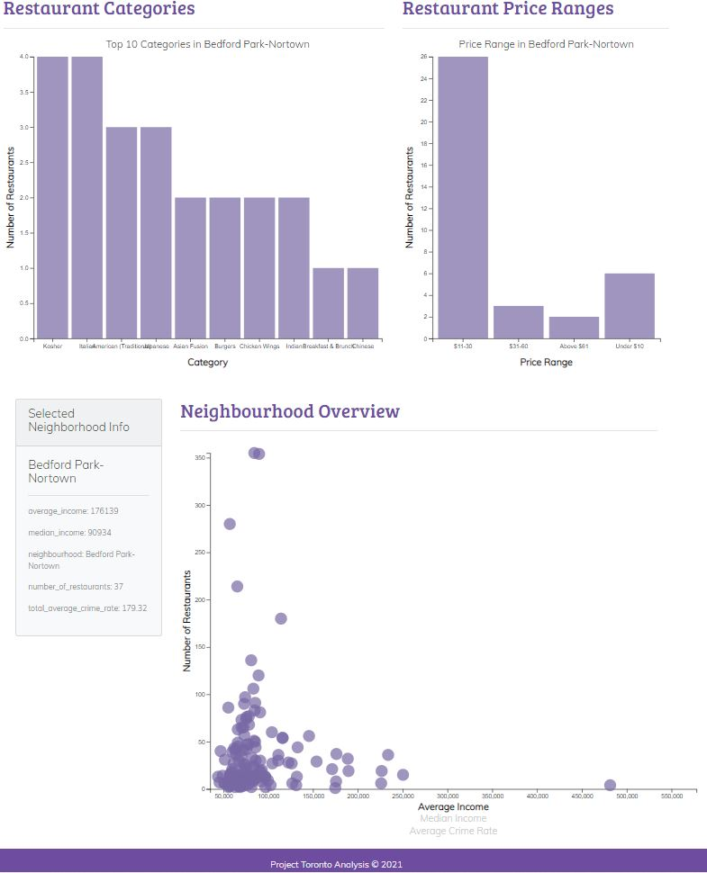

# Exploring Toronto Neighborhoods - to open a new Restaurant

**Submitted By:** Dong Yi Kim | Saif Gorges | Saloni Gupta | Sooyeon Kim  
_Date_: February, 18th, 2021\
Visualization Project- **Toronto Restaurant Data Application**  

Find the completed Toronto New Restaurant Analysis dashboard here: [Toronto New Restaurant Analysis](https://bootcamp-gta-restaurant-app.herokuapp.com/)

## Table of Contents
  * [Overview](#overview)
  * [Data Sources](#data-sources)
  * [Data Visualization](#data-visualization)
    * [Toronto Neighbourhood Map](#map)
    * [Toronto Neighbourhood Overview](#interactive-map)
    * [Ethinicty](#ethnicity)
    * [Restaurant Categories and Price Range ](#restaurant2)
  * [Final Proposal](#final-proposal)
  * [Technologies](#technologies)

## Overview
What are the best neighbourhoods in Toronto to open up a restaurant business? Toronto, the capital of the province of Ontario, is the most populous Canadian city. Its diversity is reflected in Toronto’s ethnic neighborhoods such as Chinatown, Corso Italia, Greektown, Kensington Market, Koreatown, Little India, Little Italy, Little Jamaica, Little Portugal & Roncesvalles. Since we already know that Toronto shelters a greater number of ethnicity than any other city in Canada, it is a good idea to start the restaurant here, but we just need to make sure whether it is a profitable idea or not. If so, where we can place it, so it yields more profit to the owner. Choosing a new restaurant location is the most important, at the same time, the most difficult decision throughout the whole process. Our goal for this project is to create a dashboard page with multiple interactive graphs and maps that gives an insight at restaurant data as well as neighbourhood information in Toronto. The dashboard would help new restaurant owners decide as to where the best placement of a new restaurant could be considering ethnicity, local competition, income and crime rate per neighborhood to help determine whether a restaurant could potentially be profitable or not for each neighborhood.

## Research Question
What are the best neighbourhoods in Toronto to open up a restaurant business?  
Based on:  
- Ethnicity of Population per neighbourhood  
  Factor that can help in deciding which neighborhood would be the best option to open a restaurant is, the distribution of population based on the ethnic diversity for each     neighborhood. As this helps us in identifying the neighborhoods which are densely populated with which ethnicity crowd since that neighborhood would be an ideal place to       open a restaurant.
- Competition for a given Restaurant Category per neighbourhood  
  Another deciding factor is a restaurant category, to open a new restaurant with different theme/category and identify which category has the most number of restaurants i.e.     high occurences for the selected neighbourhood.
- Distribution of Price Range per neighbourhood  
  We can also analyse the price range for the number of restaurants in the selected neighbourhood.
- Average/Median Income, Average Crime Rate for all Neighbourhoods in Toronto and corresponding Number of Restaurants.
  We can analyse each neighbourhood's Average Income and Crime Rate and Number of Restaurants which will help us find ideal location to invest in a restaurant by choosing low     crime rate and less number of restaurants to wipe out the competition and be ahead of the game.
  

## Data Sources
In this project, we created a dashboard page with these transformed datasets: Toronto Neighbourhood, Income, Crime, Toronto Restaurants Data, Restaurants Ratings. 
 
 Datasets Sources:   
  * Toronto Neighbourhood Data - Toronto City Open Data
  * Toronto Neighbourhood Income - Toronto City Open Data
  * Toronto Crime Data - Toronto City Open Data
  * Toronto Ethnicity Data - Toronto City Open Data Json API
  * Toronto Restaurant Data - Kaggle
  * Restaurant Ratings & number of reviews - Yelp API
  
  ##  Architectural Diagram
  
  
  ## 🔭 ETL Process
  ### Extract
  Data sourced from [Toronto data](https://open.toronto.ca/dataset/neighbourhood-profiles/) for the City's 140 neighbourhoods highlighting Average and Median Income, Average     Crime Rate and Ethnicity. We also wanted to analyse [Toronto Restaurant data](https://www.kaggle.com/kevinbi/toronto-restaurants/version/1) to see Restaurant Category and       Price Range and explore spatial distribution of restaurants in Toronto neighbourhoods.
  ### Transform
  Data cleaned and transformed by using Python Jupyter Notebook - [Transform.ipynb](./Toronto-Analysis-Heroku/Unpack%20me/ETL/Transform.ipynb).
  ### Load
  - This project used Python Jupyter Notebook to load transformed data in to PostgreSQL database - [Load.ipynb](./Toronto-Analysis-Heroku/Unpack%20me/ETL/Load.ipynb)
  - Python Flask–powered RESTful API were used to deploy the data into the web, and API end point links created. API links store our cleaned and transformed data in json format and are publicly accessible for visitors of our website.
  
  ## Data Visualization
  ### [1] Toronto Neighbourhood Map 
  * A Toronto Neighbourhood Geomap was created using Leaflet. Other graphs which give restaurant data as well as neighbourhood information in Toronto are connected to this core map. The user picks a nighbourhood by clicking on a map.   
  
  
  
  ### [2] Toronto Neighbourhood Overview 
  * A interactive scatter plot was created using the D3 techniques, It displays Average, Median Income and Average Crime Rate for all neighbourhoods in Toronto and corresponding number of restaurants. The data was pulled by using sqlalchemy and the d3.json function. Additional labels were added in the scatter plot and click events were given to them so that the users can decide which data to display. The transitions for the circles' locations as well as the range of the x axis was animated. Three labels for each axis were created. Tooltips were added to the circles and each tooltip with the data that the user has selected will be displayed. 
 Furthermore, Selected neighbourhood information(Average/Median income, Crime rate) is displayed on Panel.
  
    
  
  ### [3] Totonro Ethinicty in Each Neighbourhood 
  * The selected neighbourhood information from Toronto Geomap is passed into the ethnicity. The Toronto Ethnicity Barchart is created and annotated from API calls with labels, text and hover information. Bar graph represents the ethnicity of each region in Toronto. 
  
  
  
  ### [4] Toronto Restaurant Categories and Price Range 
  * The selected neighhourhood information is also passed into the price range routes which will then run a query to the PostgreSQL Database via SQLAlchemy to fetch their corresponding data for the neighbourhood selected on the map.  Using filter, groupby, orderby, and count functions, this bar graph shows the top 10 categories in a community and the number of restaurants. The data returned was used to generate a D3 barchart for Category--Restaurant Number and for Price Range--Restaurant Number. Tooltips were added to the bars, and each tooltip with the data that the user has selected will be displayed. 
  
  
  
  ## Data Analysis
  Neighbourhoods like Bridle Path Sunnybrook York Mills and Lawrence Park South are the optimal places/neighbourhoods to open up a restaurant.  
  supporting reasons:  
  - Both neighbourhoods have the highest Average Income, Median Income.  
  - They have comparitively very low number of restaurants than other neighbourhoods at 4 and 15 respectively.  
  - The Crime Rate in these neighbourhoods is very low making them a safer option.  
  Additionally, we can also see that both these neighbourhoods are highly populated with european origins followed by asian origins, ideal for opening similar ethnic cuisines     which gives a higher number of customers possibility and lower competition.  
  If we further drill down  
    - for Bridle Path Sunnybrook York Mills, since there are few restaurants with only four options as Burgers, Cafes, Seafood and Breakfast and Brunch,
   so there are vast options to open new restaurant with different theme/category.
    - for Lawrence Park South, there are 4 japanese and 3 italian restaurants, so there are other options to open new restaurant with different theme/category.
  
  ## Fianl Proposal
  * The final proposal is deployed through the Heroku.
  
  
  
  
 ## Over All layout

 ## Deployment
 This app is deployed public on Heroku App, click the following link to see how it looks like [Toronto Metrics](https://bootcamp-gta-restaurant-app.herokuapp.com/)
 
 
## <a name="technologies">Technologies</a>
This project was created with:
* JavaScript
* HTML/CSS
* D3.js
* Plotly
* SQLAlchemy
* Flask
* Python 3.8
* Pandas
* Jupyter Notebook
* PostgreSQL
* Leaflet
